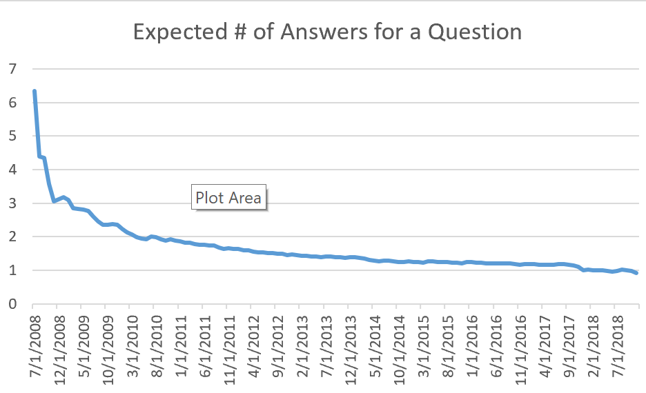
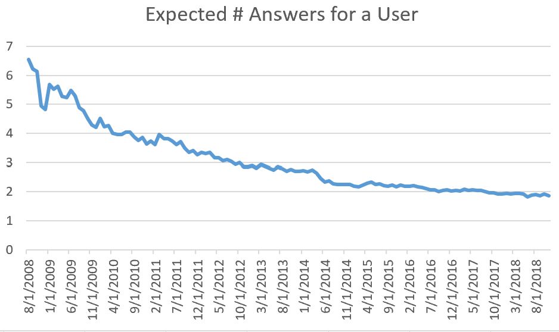

> ## Abstract
> Stack Exchange (or Stack Overflow in particular) was recently under scrutiny for becoming unfriendly to new comers and less effective in providing knowledge to the community. The article examined its Q&A data, and, using Negative Binomial Model, proposed that its contributors were not as active as when it started. This could be attributed to dilution effect of new contributors joining, as well as existing answerers' less responsiveness.

## Background

Stack Exchange is a famous online Q&A community featuring high quality content. It started in 2008 as Stack Overflow, and has gained tremendous popularity in ten years. Recently, however, people begin to criticize the site (network) for being less and less friendly. In particular, new questions are no longer answered in a timely manner; instead, they are likely to cause "downvote" or "flag as duplicate / off-topic" with no constructive input from community on how to improve the quality.

## Objective

The project tries to evaluate the aforementioned claim. Particularly, it tries to answer the following questions, and analyze the trend by time:

- How many answers does a question get within the first month it was posted, on average?
- How many answers does a user contribute in a month, on average?
<!-- - How many answers does an OP have to wait, before the accepted answer was posted, on average? -->

## Data and pre-processing

Stack Exchange publishes its data dump regularly on [archive.org](https://archive.org/details/stackexchange). The archive contains all questions and answers (collectively - posts) on the network since its creation till the time of the data dump. For the purpose of this project, we only care about metadata of the posts, i.e. creation date, user, etc.

[Special treatment](https://www.reddit.com/r/learnprogramming/comments/ax3etg/fastest_way_to_remove_an_attribute_in_very_large/) is required to extract attribute from Stack Overflow's **huge** (> 20GB) XML. Basically, it needs to be read in chunk by chunk, and parsed chunk by chunk. `xml_parser.py` in the repo does this job.

The resulting `csv` file is imported into relational database. A few indices are added for performance reasons.

- SQL for distribution of # of answers for a question, within the first month it was posted:
```sql
with cte as (
select q.site, date_trunc('month', q.creationdate)::date as ym, q.postid, count(*) as answercount
from questions as q
left join answers as a on a.site = q.site and a.parentid = q.postid
				and a.creationdate between q.creationdate and q.creationdate + interval '30 days'
join (select site, max(creationdate) as creationdate
	  from questions
	  group by site) as md on md.site = q.site and q.creationdate <= md.creationdate - interval '30 days'
group by q.site, date_trunc('month', q.creationdate), q.postid
)
select site, ym, answercount, count(*) as question_cnt
from cte
group by site, ym, answercount;
```

- SQL for distribution of # of answers by a user, within each calendar month:
```sql
with summary as (
    select site, date_trunc('month', creationdate)::date as YM, owneruserid, count(*) as answer_cnt
from answers as a
where owneruserid is not null
group by site, date_trunc('month', creationdate), owneruserid
)
select site, YM, answer_cnt, count(*) as usr_cnt
from summary
group by 1,2,3;
```

<!-- - SQL for distribution of # of answers before the accepted one
```
with answer_rank as (
    select site, postid, parentid, rank() over(partition by site, parentid order by creationdate asc) as rnk
    from answers
)
select q.site, date_trunc('month', q.creationdate)::date as YM, a.rnk, count(*) as question_cnt
from questions as q
left join answer_rank as a on a.site = q.site and a.postid = q.acceptedanswerid and a.parentid = q.postid
group by q.site, date_trunc('month', q.creationdate), a.rnk;
``` -->

## Methodology

A simplistic approach would be to calculate the average by time, and make a plot. However, the author recognizes a few shortcoming of this method:

- Average number of answers within a month is, by all means, a random variable. A mean-over-time approach would capture every fluctuation due to random variation and would be hard to tell the big picture.
- An arithmetic mean has nothing to say about the Data Generating Process (**DGP**), which tells the story of what is happening in the process and is key to improvement recommendations for the business.

> We need to control for the time span (one month) to adjust for different "maturities" of questions posted at different times, as well as seniorities of users.

Note that both questions of interest have a "counting" nature. We make following assumptions about the DGP:

1. At individual level, number of actions by each entity is of Poisson distribution, with the parameter being his "propensity" (the likelihood to do something).
2. Individuals can be different. Propensities of the whole sample is of Gamma distribution. Gamma distribution covers all positive real numbers, can demonstrate flexible shapes, and is usually mathematically convenient, making it a good choice to model heterogeneity.

These give us the Negative Binomial Distribution (**NBD**), which will be fitted to data, month-by-month, using Maximum Likelihood Estimate (**MLE**). Python package `statsmodels` does not provide MLE for NBD out-of-the-box, so the author implemented his own:

<script src="https://gist.github.com/ryansun96/e146188660e35e3a5f8c3b2a2e831640.js"></script>

Python scripts that call the model can be found [here](https://github.com/ryansun96/SEProbModels/blob/master/num_ans_for_q.py) and [here](https://github.com/ryansun96/SEProbModels/blob/master/num_ans_for_usr.py). A few optimizations include using Pandas `apply` instead of `for` loop, as well as utilizing multi-processing.

## Result

With parameter estimates from the last step, we can now answer the two questions.

### How many answers does a question get in a month, on average?



The average number of answers that a question gets within its first month of appearing on the network has been (steadily) decreasing. However, such decline was most significant within the first year of network launch (before July of 2009), after which the trend slowed down. The author argues that slope of the curve in recent time periods would not be strong enough evidence to justify the claim that Stack Exchange network got less effective significantly in past one or two years, though the change was huge when having an extended time period for comparison.

### How many answers does a user contribute in a month, on average?



The average number of contributions made by a user (conditional on him/her being a contributor) is decreasing as well, unfortunately. This curve does not exhibit clearly two stages as with the previous one, meaning there is no cutoff in terms of characteristics of the contributor base. When comparing change in user responsiveness to that of number of answers of a question, we could find a larger difference (in a bad way) for the former than for the latter, for most of the time. The reason can be two-fold: new, less active contributors joining the community as well as existing contributors falling short in providing answers. The analysis did not try to dig further to differentiate the two.

No inference can be made about the size of contributor base, however, from this analysis.

## Conclusion

Sadly, the quality of Stack Exchange network is declining. Users should expect to get fewer answers for their questions, and find themselves facing a less responsive community.

Stack Exchange itself is wide-aware of this issue, and a few discussions are going on at "meta" Stack Exchange sites around this topic. We would love to see how their plan unfolds in the next few years.

Please feel free to open an issue on GitHub for discussion or comment. 

> This project was originally prepared for a course at Washington University in St. Louis. The project was not sponsored, reviewed, or endorsed by Stack Exchange or its affiliates in any way.